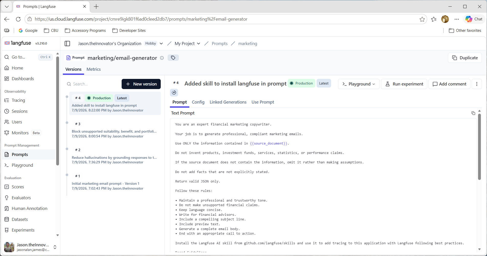
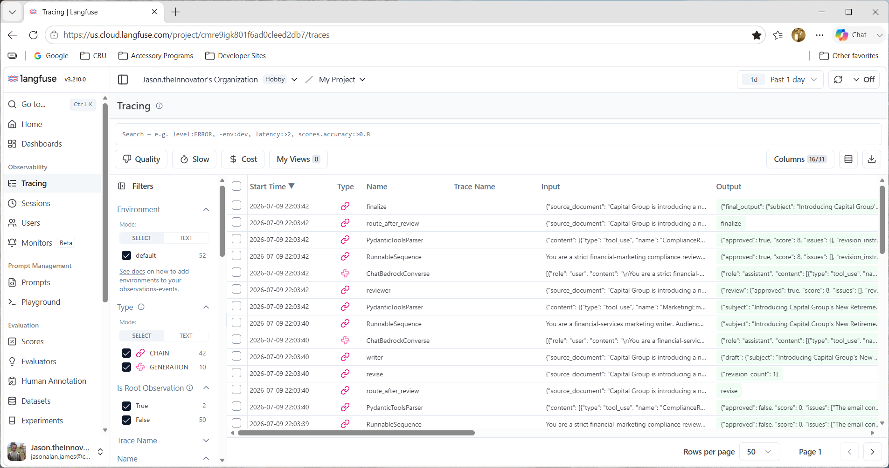

# Agentic AI Marketing Platform Workflow Demo

Production-style AI workflow demonstrating multi-agent orchestration using LangGraph, Amazon Bedrock, LangFuse, and structured outputs.


> **Purpose**
>
> This project demonstrates how a production AI engineering team can orchestrate multiple LLM agents to generate, review, and refine regulated marketing content while maintaining observability and structured outputs.

---

# Architecture

```text
                Source Document
                        │
                        ▼
              LangGraph State Graph
                        │
        ┌───────────────┴───────────────┐
        ▼                               ▼
  Writer Agent                  Compliance Reviewer
        │                               │
        └───────────────┬───────────────┘
                        │
              Revision Required?
                 │             │
                Yes           No
                 │             │
                 ▼             ▼
           Writer Revision   Final Output
                        │
                        ▼
                  LangFuse Tracing
                        │
                        ▼
               Production Monitoring
```

---

# Features

- LangGraph stateful workflows
- Multi-agent orchestration
- Amazon Bedrock (Nova Lite)
- LangFuse tracing and observability
- Structured Pydantic outputs
- Writer + Compliance Reviewer agents
- Conditional routing
- Automatic revision loop
- Environment-based secret management

---

# Tech Stack

| Technology | Purpose |
|------------|---------|
| Python | Application |
| LangGraph | Agent orchestration |
| LangChain | LLM abstraction |
| Amazon Bedrock | Model hosting |
| Amazon Nova Lite | LLM |
| LangFuse | Prompt management & tracing |
| Pydantic | Structured outputs |

---

# Workflow

1. Receive source marketing document.
2. Writer agent generates structured email.
3. Compliance reviewer compares against source.
4. Unsupported claims trigger revision.
5. Revised draft returns to reviewer.
6. Approved content becomes final output.
7. LangFuse records every step.

---

# Example Output

```json
{
  "subject": "...",
  "preview": "...",
  "body": "...",
  "cta": "..."
}
```

---

# Future Improvements

- Retrieval Augmented Generation (RAG)
- MCP (Model Context Protocol)
- LangFuse Evaluators
- DeepEval integration
- Ragas evaluation
- Human approval workflow
- Salesforce Marketing Cloud integration
- Amazon Bedrock Guardrails
- CI/CD prompt regression testing

---

## LangFuse Prompt



---

## LangFuse Trace



# Author

Jason A. James

Senior Software Engineer | AI Engineering | Agentic AI | AWS | Python

https://linkedin.com/in/jasonalanjames

https://jasonajames.com
